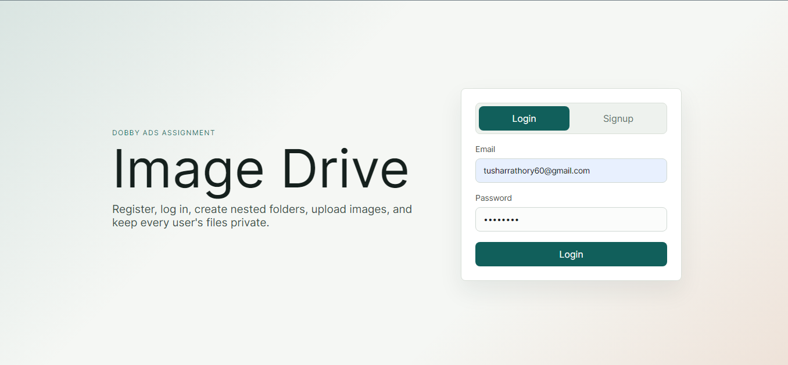
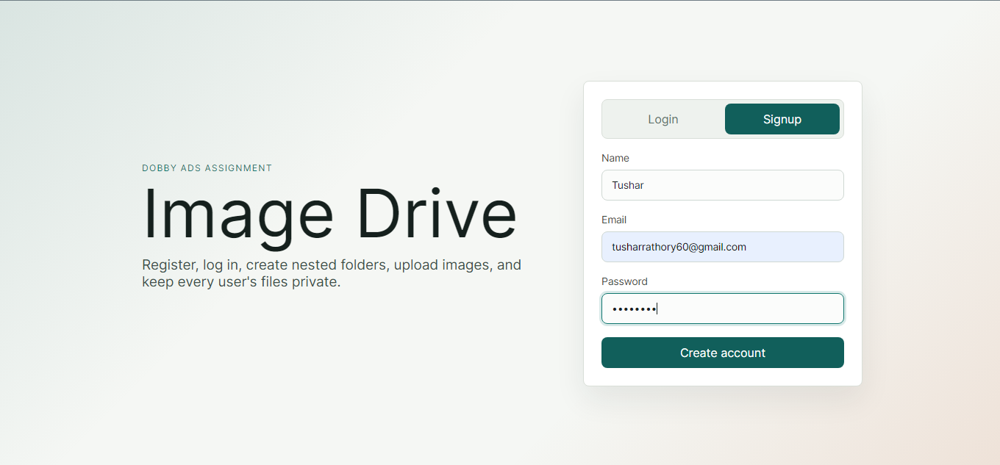
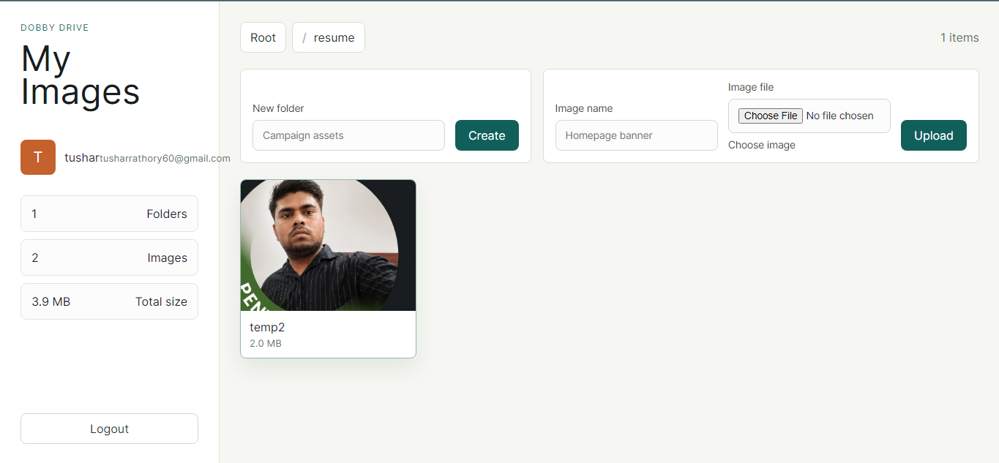

# Dobby Drive Full Stack Assignment

Full stack image-drive app for the Dobby Ads assignment.

## Features

- Signup, login, and logout
- JWT authentication in Node.js
- User-specific folders and images
- Nested folders
- Image upload with name and image file validation
- Recursive folder-size calculation, including all nested images
- React frontend connected to the Express API
- MongoDB persistence

## Screenshots







## API Documentation

Base URL: `http://127.0.0.1:5000`

### Authentication

- `POST /api/auth/signup`
  - Body: `name`, `email`, `password`
  - Returns: `{ token, user }`

- `POST /api/auth/login`
  - Body: `email`, `password`
  - Returns: `{ token, user }`

- `GET /api/auth/me`
  - Headers: `Authorization: Bearer <token>`
  - Returns: `{ user }`

### Drive

- `GET /api/folders`
  - Headers: `Authorization: Bearer <token>`
  - Returns: `{ folders: [...], images: [...] }`

- `POST /api/folders`
  - Headers: `Authorization: Bearer <token>`
  - Body: `name`, `parentId` (optional)
  - Returns: `{ folder }`

- `POST /api/images`
  - Headers: `Authorization: Bearer <token>`
  - Body: multipart/form-data with `name`, `folderId` (optional), and `image`
  - Returns: `{ image }`

- `GET /api/health`
  - Returns: `{ ok: true }`

Uploaded images are served from `/uploads/<filename>`.

## Setup

1. Install dependencies:

```bash
npm run install:all
```

2. Create backend environment file:

```bash
copy backend\.env.example backend\.env
```

Update `JWT_SECRET` in `backend\.env`. Keep `MONGO_URI` as-is if MongoDB is running locally.

3. Create frontend environment file:

```bash
copy frontend\.env.example frontend\.env
```

4. Start MongoDB. If you use Docker:

```bash
docker compose up -d
```

5. Run the backend:

```bash
npm run dev:backend
```

6. In another terminal, run the frontend:

```bash
npm run dev:frontend
```

Frontend: `http://127.0.0.1:5173`

Backend: `http://127.0.0.1:5000`
